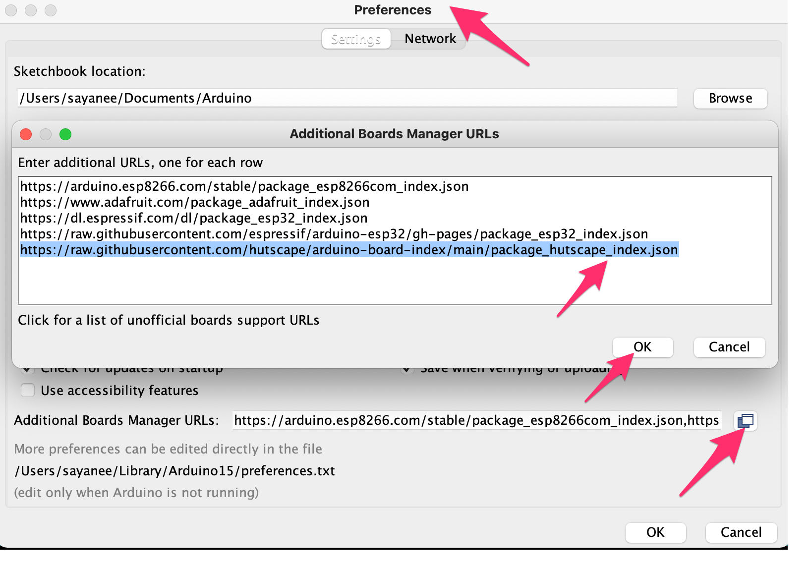
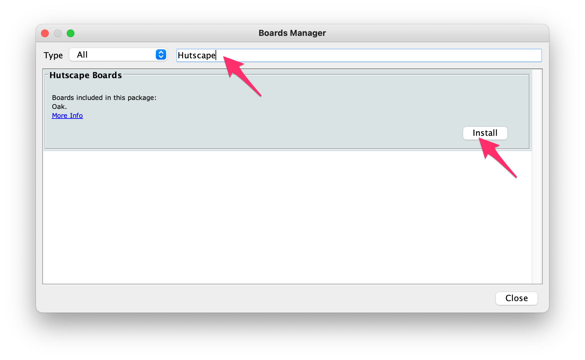

# Arduino Boards

> This repo contains the custom `package_hutscape_index.json` files that can be used to add new third party boards to the Arduino `v1.6.4+` IDE.

## Getting Started

1. Copy and paste the following URL into the File > Preferences > "Additional Boards Manager" textbox in Arduino IDE
    ```
    https://raw.githubusercontent.com/hutscape/arduino-board-index/main/package_hutscape_index.json
    ```
    
1. Restart Arduino IDE
1. Go to Tools > Boards Manager > Search for Hutscape or Oak
    
1. Install it!
